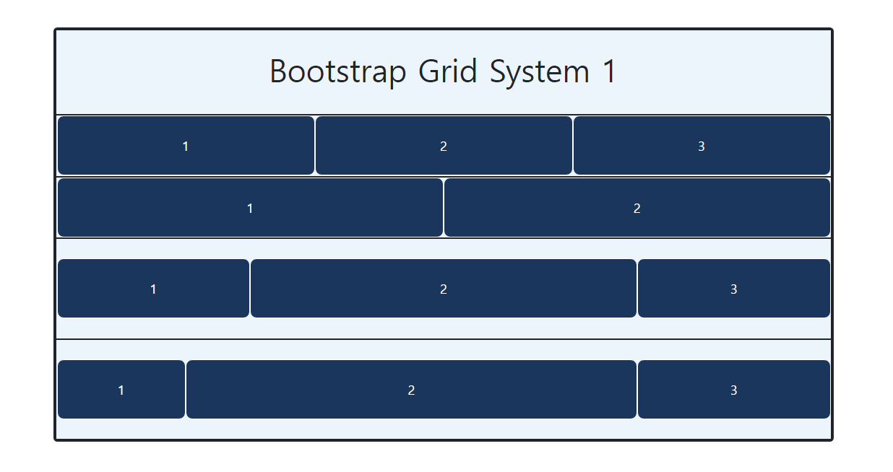
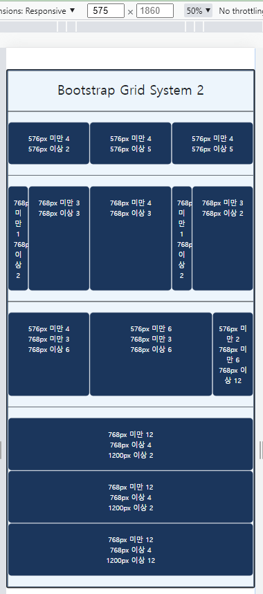
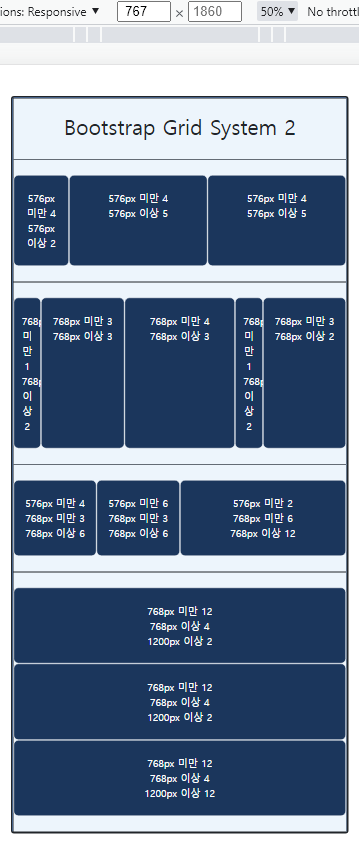
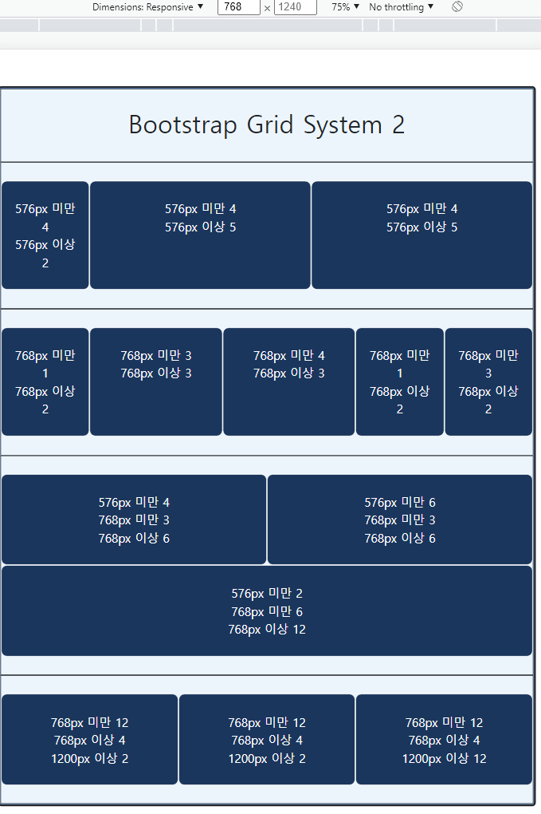
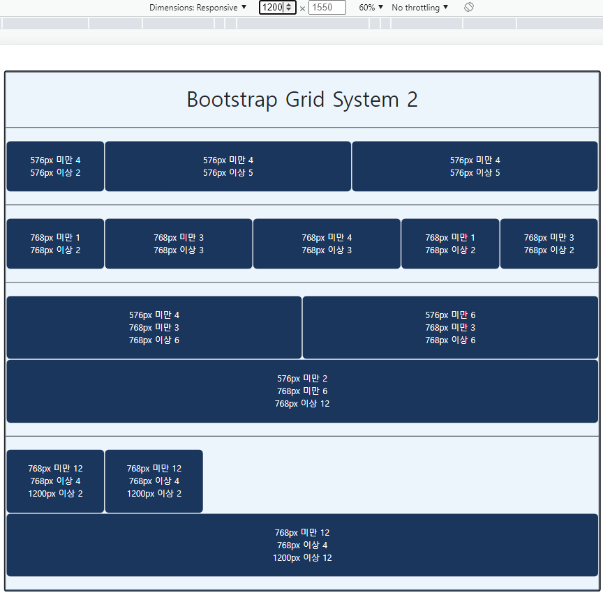

# 0208_workshop

## 1. 기본 그리드 레이아웃

1. 제시된 3개의 컬럼이 container를 가득 채우도록 클래스를 추가 작성 (컬럼의 너비는 동일)

   ```html
   <div class="row p-0">
       <div class="item col">
           <p>1</p>
       </div>
       <div class="item col">
           <p>2</p>
       </div>
       <div class="item col">
           <p>3</p>
       </div>
   </div>
   ```

2. 제시된 2개의 컬럼이 container를 가득 채우도록 클래스 변경 (컬럼의 너비 동일)

   ```html
   <div class="row p-0">
       <div class="item col-6">
           <p>1</p>
       </div>
       <div class="item col-6">
           <p>2</p>
       </div>   
   </div>
   ```

3. 제시된 3개의 컬럼이 3칸, 6칸, 3칸씩 차지하도록 마크업과 클래스를 변경

   ```html
   <div class="row">
       <div class="item col-3">
           <p>1</p>
       </div>  
       <div class="item col-6">
           <p>2</p>
       </div>
       <div class="item col-3">
           <p>3</p>
       </div>
   </div> 
   ```

4. 제시된 3개의 컬럼이 2칸, 7칸, 3칸씩 차지하도록 클래스 변경

   ```html
   <div class="row">
       <div class="item col-2">
           <p>1</p>
       </div>
       <div class="item col-7">
           <p>2</p>
       </div>
       <div class="item col-3">
           <p>3</p>
       </div> 
   </div>
   ```



## 2. 반응형 그리드

1. Viewport 너비가 576px 미만인 경우, 칵 컬럼 4, 4, 4 씩 차지하고 이상인 경우, 2, 5, 5 씩 차지하도록 클래스 추가

   ```html
   <div class="row">
       <div class="item col-4 col-sm-2">
           <p>576px 미만 4 <br> 576px 이상 2</p>
       </div>
       <div class="item col-4 col-sm-5">
           <p>576px 미만 4 <br> 576px 이상 5</p>
       </div>
       <div class="item col-4 col-sm-5">
           <p>576px 미만 4 <br> 576px 이상 5</p>
       </div>
   </div>
   ```

2. Viewport 너비가 768px 미만인 경우, 칵 컬럼 1, 3, 4, 1 씩 차지하고 이상인 경우, 2, 3, 3, 2, 2 씩 차지하도록 클래스 추가

   ```html
   <div class="row">
       <div class="item col-1 col-md-2">
           <p>768px 미만 1 <br> 768px 이상 2</p>
       </div>
       <div class="item col-3 col-md-3">
           <p>768px 미만 3 <br> 768px 이상 3</p>
       </div>
       <div class="item col-4 col-md-3">
           <p>768px 미만 4 <br> 768px 이상 3</p>
       </div>
       <div class="item col-1 col-md-2">
           <p>768px 미만 1 <br> 768px 이상 2</p>
       </div>
       <div class="item col-3 col-md-2">
           <p>768px 미만 3 <br> 768px 이상 2</p>
       </div>
   </div>
   ```

3. Viewport 너비가 576px 미만인 경우, 칵 컬럼 4, 6, 2 씩 차지하고 이상인 경우, 3, 3, 6 씩 차지하며 768px 이상인 경우, 6, 6, 12 씩 차지하도록 클래스 추가

   ```html
   <div class="row">
       <div class="item col-4 col-sm-3 col-md-6">
           <p>576px 미만 4 <br> 768px 미만 3 <br> 768px 이상 6</p>
       </div>
       <div class="item col-6 col-sm-3 col-md-6">
           <p>576px 미만 6 <br> 768px 미만 3 <br> 768px 이상 6</p>
       </div>
       <div class="item col-2 col-sm-6 col-md-12">
           <p>576px 미만 2 <br> 768px 미만 6 <br> 768px 이상 12</p>
       </div>
   </div>
   ```

4. Viewport 너비가 768px 미만인 경우, 칵 컬럼 12, 12, 12 씩 차지하고 이상인 경우, 4, 4, 4 씩 차지하며 1200px 이상인 경우, 2, 2 씩 차지하고 12 차지하는 컬럼이 그 다음에 내려오도록 클래스 추가

   ```html
   <div class="row">
       <div class="item col-sm-12 col-md-4 col-xl-2">
           <p>768px 미만 12 <br> 768px 이상 4 <br> 1200px 이상 2</p>
       </div>
       <div class="item col-sm-12 col-md-4 col-xl-2">
           <p>768px 미만 12 <br> 768px 이상 4 <br> 1200px 이상 2</p>
       </div>
       <div class="item col-sm-12 col-md-4 col-xl-12">
           <p>768px 미만 12 <br> 768px 이상 4 <br> 1200px 이상 12</p>
       </div>
   </div>
   </div>
   ```

- 575px 일 때

  

- 767px 일 때

  

- 768px 일 때

  

- 1200px 일 때

  


## 3. 그리드 심화 (offset 클래스 활용)

1. Viewport가 768px 미만인 경우, 각 컬럼이 4, 8 씩 차치하도록 하고 이상인 경우, 4, 4 씩 양 끝에서 차지하며 가운데 4만큼 빈 공간이 생기도록 클래스 추가

   ```html
   <div class="row justify-content-md-between">
       <div class="item col-4 col-md-4">
           <p>item1</p>
       </div>
       <div class="item col-8 col-md-4">
           <p>item2</p>
       </div>
   </div>
   ```

2. `offset` 활용

   1. Viewport가 768px 미만인 경우, 각 컬럼이 4, 4 양 끝에 차지하며 가운데 4만큼 빈 공간
   2. 992px 미만인 경우 4만큼 빈 공간이 앞에 컬럼은 4, 4, 씩
   3. 이상인 경우 7만큼 앞에 빈 공간 뒤에 5칸 컬럼과 아래 줄에 앞뒤 2칸의 빈 공간 사이에 8칸을 차지하는 컬럼

   ```html
   <div class="row justify-content-between justify-content-md-end justify-content-lg-start">
       <div class="item col-4 col-md-4 col-lg-5 offset-lg-7">
           <p>item1</p>
       </div>
       <div class="item col-4 col-md-4 col-lg-8 offset-lg-2">
           <p>item2</p>
       </div>
   </div>
   ```

   `offset` 은 해당 해상도일 때 해당 칸 만큼 컬럼을 밀어주는 역할이다.

   `sm`나 `md`나 `lg` 다 이상일 때 항시 적용이기 때문에, `md` 이상일 때 `justify-content-lg-start`로 리셋시켜줘야 `offset-lg-x`가 정상 작동할 수 있다. 리셋 처리 안해주면 `justify-content-end`로 적용된다

3. `Nesting` 활용

   ```html
   <div class="row">
       <div class="item col col-md-3 col-lg-3">
           item1
       </div>
       <div class="item col col-md-9 col-lg-9">
           <div class="row">
               <div class="item col-6 col-md-6 col-lg-3">item2</div>
               <div class="item col-6 col-md-6 col-lg-3">item3</div>
               <div class="item col-6 col-md-6 col-lg-3">item4</div>
               <div class="item col-6 col-md-6 col-lg-3">item5</div>
           </div>
       </div>
   </div>
   ```

   grid는 column 안에 column을 넣어도 똑같이 12칸 개념으로 작동한다. 

