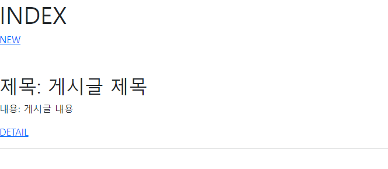
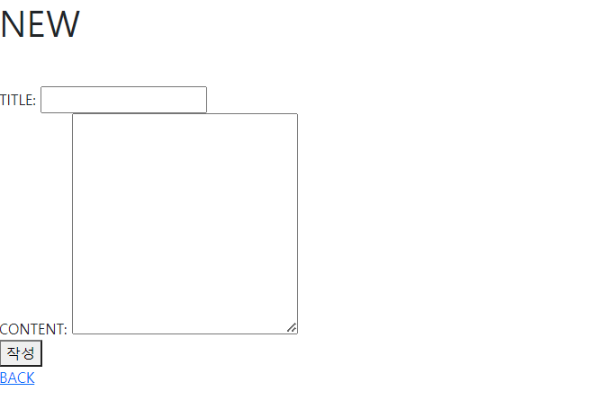
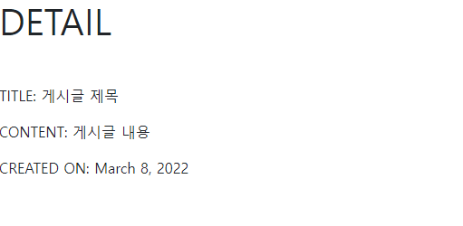

# 0308_workshop


## 1. 사전 준비

1. 가상환경 생성 & 활성화
2. django 3.2.12 설치
3. `runserver`

## 2. 기본 설정

1. 프로젝트 이름 `crud`, 앱 이름 `articles` 생성 & 출생신고
2. 상속시킬 `base.html` 작성
   - `manage.py`와 같은 레벨에 `templates/base.html/` 생성
   - `crud/settings.py`에 `BASE_DIR` `'templates'`로 지정
   - `crud/urls.py`에 `include` 불러와서 `articles.urls`로 경로 생성
   - `articles/urls.py` 생성

## 3. Database 생성

`articles/models.py`에 Article 클래스를 작성한다

```python
from django.db import models

# Create your models here.
class Article(models.Model):
    title = models.CharField(max_length=100)
    content = models.TextField()
    created_at = models.DateField(auto_now_add=True)
```

Article 클래스의 속성 (attributes)에 상응하는 총 3가지의 필드 title, content, created_at을 가진 Article 테이블이 생성된다

```bash
$ python manage.py makemigrations articles
```

`0001_initial.py`가 `articles/migrations/`에 생성된다

```python
# Generated by Django 3.2.12 on 2022-03-08 08:49

from django.db import migrations, models


class Migration(migrations.Migration):

    initial = True

    dependencies = [
    ]

    operations = [
        migrations.CreateModel(
            name='Article',
            fields=[
                ('id', models.BigAutoField(auto_created=True, primary_key=True, serialize=False, verbose_name='ID')),
                ('title', models.CharField(max_length=100)),
                ('content', models.TextField()),
                ('created_at', models.DateField(auto_now_add=True)),
            ],
        ),
    ]
```

`models.py`에 작성한 필드값들이 담겨져있다.

```bash
$ python manage.py migrate
```

table이 DB에 저장된다

## 4. INDEX 페이지 생성

### Url 작성

`articles/urls.py`에 `localhost:8000/artticles/` 페이지를 구성하는 다른 url 경로들을 작성해준다

```python
from django.urls import path
from . import views

app_name = 'articles'

urlpatterns = [
    path('', views.index, name='index'),
    path('new/', views.new, name='new'),
    path('create/', views.create, name='create'),
    path('<int:pk>/', views.detail, name='detail'),
]
```

app_name을 지정해줘야 나중에 url 태그를 사용할 수 있다

`detail` 페이지는 variable routing을 통해 pk, 즉 primary key 값을 인자로 받아 Article 테이블 내 해당 pk 값에 상응하는 내용을 불러온다

### View 작성

`articles/views.py`에 `urls.py`가 불러온 함수들을 작성해준다

- `index` 함수

```python
from django.shortcuts import render, redirect
from .models import Article

# Create your views here.
def index(request):
    article_list = Article.objects.order_by('-created_at')
    context = {
        'article_list': article_list,
    }
    return render(request, 'articles/index.html', context)
```

Article 테이블을 리스트 형태로 불러오는데 `-created_at`에서 `-` 가 내림차순을 의미, 고로 가장 최근에 생성된 게시글이 맨 앞에 있는 리스트 `article_list`를 불러온다

- `new` 함수

```python
def new(request):
    return render(request, 'articles/new.html')
```

글을 작성하여 Article 테이블에 추가시킬 수 있는 페이지를 반환한다

- `create` 함수

```python
def create(request):
    title = request.POST.get('title')
    content = request.POST.get('content')

    # Article 클래스의 인스턴스 변수 생성
    article = Article()
    # 필드값
    article.title = title
    article.content = content
    # DB에 저장
    article.save()

    # DB를 보여주는 메인페이지 'articles/'로 이동시킨다
    # 업데이트된 내용이 보여진다
    return redirect('articles:index')
```

여기서 `POST`는 form의 method로, 꼭 html에서 사용되는 form 태그의 method와 통일시켜줘야 한다

`django.shortcuts` 패키지에서 `redirect` 모듈을 불러와야 한다

- `detail` 함수

```python
def detail(request, pk):
    article = Article.objects.get(pk=pk)
    context = {
        'article': article,
    }
    return render(request, 'articles/detail.html', context)
```

variable routing으로 받은 pk 값도 인자값에 포함된다

get() 메서드를 통해 사용자가 요청한 pk값 `pk`를 지정해준다

### Template 작성

- index.html

```django



<div class="mb-4 pb-4">
  <h1>INDEX</h1>
  <a href="">NEW</a>
</div>

<div class="my-2">
  
  <div class="mb-2">
    <h2>제목: {{ article.title }}</h2>
    <p>내용: {{ article.content }}</p>
  </div>
  
  <a href="">DETAIL</a>
    <hr>
  
</div>


```

url 태그는

```django

```

식으로 사용된다

- new.html

```django



<h1 class="mb-4 pb-4">NEW</h1>

<form action="" method="POST">
  
  <div>
    <label for="title">TITLE: </label>
    <input type="text" id="title" name="title">
  </div>
  <div>
    <label for="content">CONTENT: </label>
    <textarea name="content" id="content" cols="30" rows="10"></textarea>
  </div>

  <button>작성</button>
</form>

<a href="">BACK</a>


```

`create` 함수에서 `POST` 메서드를 쓴 것과 동일하게 form 태그의 method를 꼭 `POST`로 통일시켜준다

`csrf` 토큰을 사용해 고유의 값을 저장하여 가짜 게시글이 DB에 저장되는 것을 제한한다

내용이 비교적 많이 들어갈 수 있는 `content` 칸은 `input` 대신 `textarea` 태그를 사용하여 input 박스의 크기를 지정해준다

- detail.html

```django



<h1 class="mb-4 pb-4">DETAIL</h1>

<p>TITLE: {{ article.title }} </p>
<p>CONTENT: {{ article.content }}</p>
<p>CREATED ON: {{ article.created_at }}</p>

```


## 5. 결과





