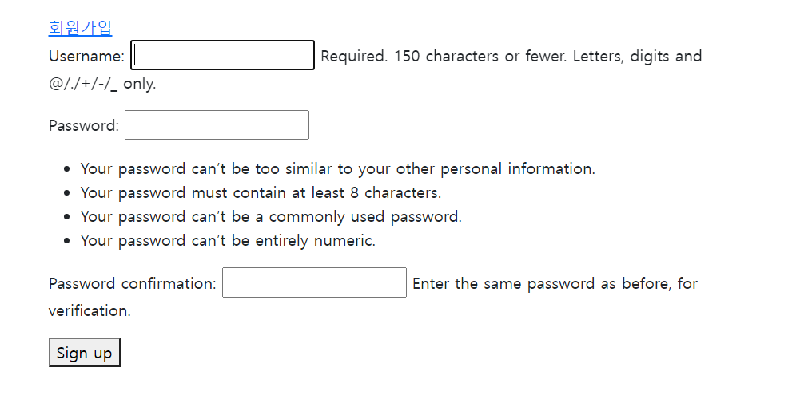
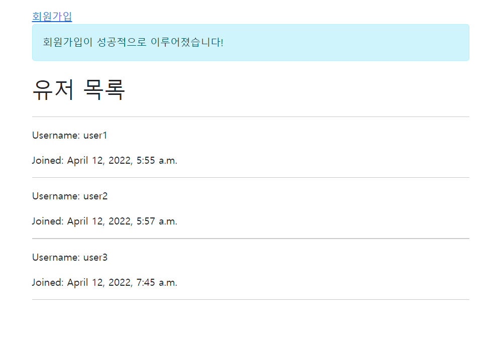

# 0411_workshop


## 1. UserStory

웹사이트가 작동하는 순서를 사용자의 관점에서 나열한 후, 개발 과정 구분하기

1. 메인 페이지 접속
   - index 함수를 불러오는 url 작성 (accounts/urls.py)
   - 메인 페이지를 렌더링하는 index 함수 작성 (views.py)
     - 유저 정보를 생성하는 django 내부의 form 불러오기 (`from django.contrib.auth.models import User`)
     - DB의 QuerySet 불러오기 (`User.objects.all()`)
   - 모든 등록된 유저들의 정보를 보여주는 index.html
     - for 태그로 `user in users` 호출
2. 회원가입 버튼 클릭
   - signup 함수를 불러오는 url 작성 (accounts/urls.py)
   - 회원가입 페이지를 렌더링하는 signup 함수 작성 (views.py)
   - signup.html로 이동시키는 a 태그 버튼 생성 (base.html)
3. 필요한 정보를 요구하는 회원가입 폼 페이지 접속
   - `django.contrib.auth.forms`에서 UserCreationForm 불러오기 (views.py)
   - `POST`가 전송되기 전에는 signup.html을 렌더링
4. 유효한 데이터 입력
   - Django 내부적으로 설정된 필드 제한
5. 회원가입 완료 버튼 클릭
   - 회원가입 완료 버튼을 눌러 입력된 정보가 form 태그로 발송되었다면 유효성 검사 후 DB에 저장하고 index.html 리다이렉트 (views.py)
6. 회원가입이 성공적으로 되었다는 메세지나 페이지 확인
   - `from django.contrib import messages`에서 messages 불러오기 (views.py)
   - 메세지 띄우는 템플렛 (index.html)


## 코드

```python
# accounts/views.py

from django.shortcuts import render, redirect
from django.contrib.auth.models import User
from django.contrib.auth.forms import UserCreationForm
from django.contrib import messages

# Create your views here.
def index(request):
    users = User.objects.all()
    context = {
        'users': users,
    }
    return render(request, 'accounts/index.html', context)


def signup(request):
    if request.method == 'POST':
        form = UserCreationForm(request.POST)
        if form.is_valid():
            form.save()
            messages.add_message(request, messages.INFO, '회원가입이 성공적으로 이루어졌습니다!')
            return redirect('accounts:index')
    else:
        form = UserCreationForm()

    context = {
        'form': form,
    }
    return render(request, 'accounts/signup.html', context)
```


## 결과 화면




