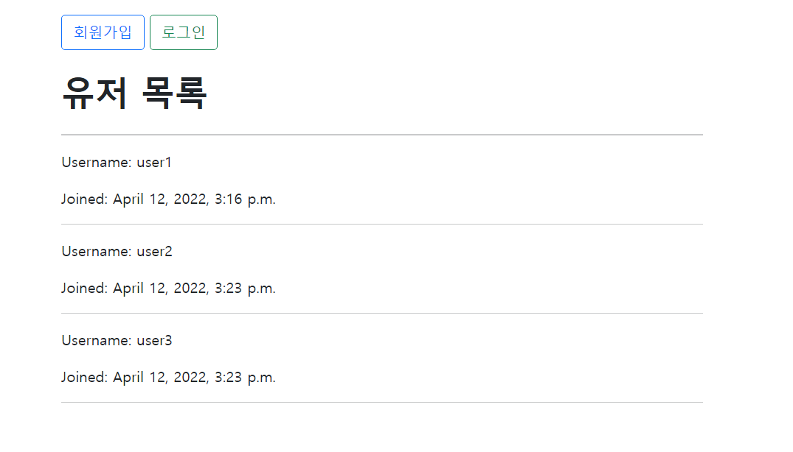
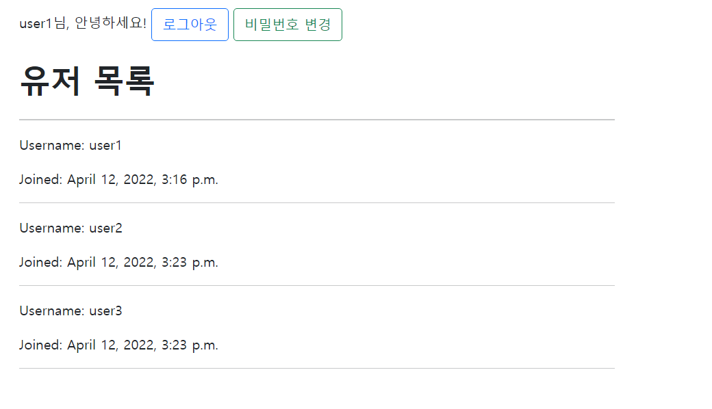
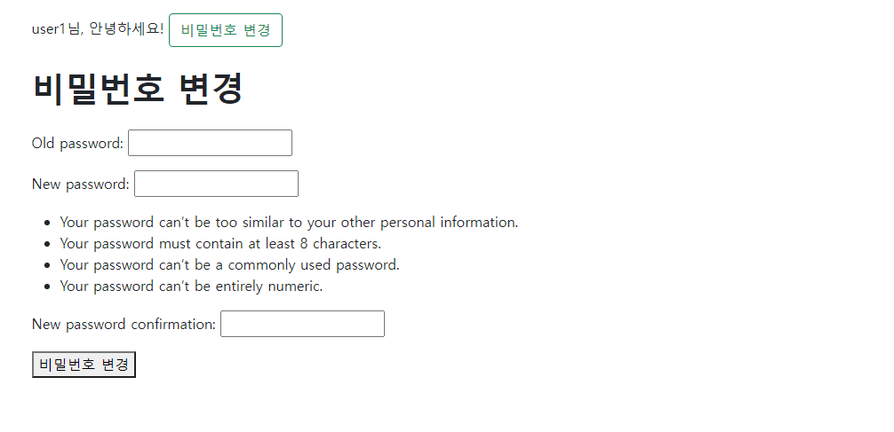
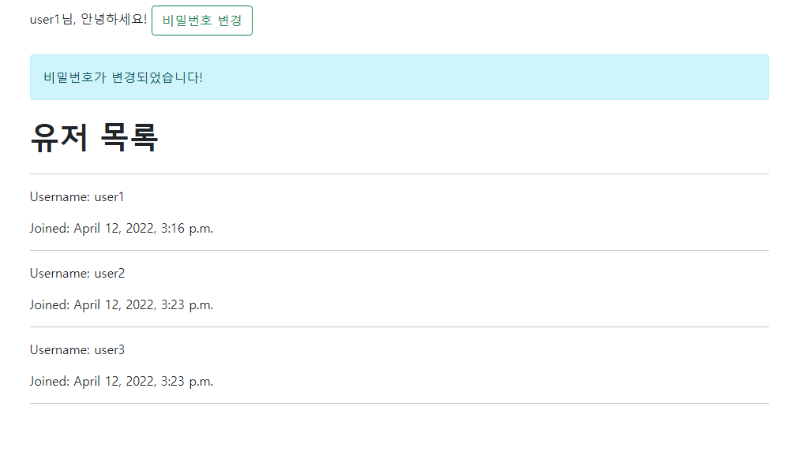

# 0412_workshop


## 1. UserStory

비밀번호 수정 기능을 구현하는데 사용자의 관점으로 접근하여 개발 순서를 짚어보자.

1. 메인 페이지에 접속한다.
2. 회원가입과 로그인 버튼 중 로그인 버튼을 누른다.
2. 로그인을 한다.
2. 상단의 버튼이 로그아웃과 비밀번호 변경으로 바뀌었다. 그 중 비밀번호 변경 버튼을 누른다.
2. 비밀번호 변경 폼이 띄워진 페이지를 띄운다.
2. 변경할 비밀번호를 입력 후 완료 버튼을 누른다.
2. 비밀번호가 성공적으로 바뀌었다는 메세지와 함께 메인 페이지로 돌아온다.

## Views.py

```python
from django.shortcuts import render, redirect
from django.contrib import messages
from django.contrib.auth import (
    login as auth_login,
    logout as auth_logout,
    update_session_auth_hash,
)
from django.contrib.auth.models import User
from django.contrib.auth.forms import (
    UserCreationForm, 
    PasswordChangeForm,
    AuthenticationForm,
)
from django.contrib.auth.decorators import login_required

# Create your views here.
def index(request):
    users = User.objects.all()
    context = {
        'users': users,
    }
    return render(request, 'accounts/index.html', context)


def signup(request):
    if request.method == 'POST':
        form = UserCreationForm(request.POST)
        if form.is_valid():
            form.save()
            messages.add_message(request, messages.INFO, '회원가입이 성공적으로 이루어졌습니다!')
            return redirect('accounts:index')
    else:
        form = UserCreationForm()

    context = {
        'form': form,
    }
    return render(request, 'accounts/signup.html', context)


def login(request):
    if request.method == 'POST':
        form = AuthenticationForm(request, request.POST)
        if form.is_valid():
            user = form.get_user()
            auth_login(request, user)
            return redirect('accounts:index')
    else:
        form = AuthenticationForm()
    
    context = {
        'form': form,
    }
    return render(request, 'accounts/login.html', context)


@login_required
def logout(request):
    auth_logout(request)
    return redirect('accounts:index')


@login_required
def change_password(request):
    if request.method == 'POST':
        form = PasswordChangeForm(request.user, request.POST)
        if form.is_valid():
            form.save()
            messages.add_message(request, messages.INFO, '비밀번호가 변경되었습니다!')
            update_session_auth_hash(request, form.user)
            return redirect('accounts:index')
    else:
        form = PasswordChangeForm(user=request.user)
    
    context = {
        'form': form,
    }
    return render(request, 'accounts/update.html', context)
```


## 결과 화면







