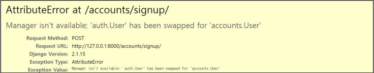

# 0419_homework


## 1. M:N True or False

1. Django에서 1:N 관계는 ForeignKeyField를 사용하고, M:N 관계는 ManyToManyField를 사용한다 **(T)**
2. ManyToManyField를 설정하고 만들어지는 테이블 이름은 *"앱이름`_`클래스이름`_`지정한 필드이름"*의 형태로 만들어진다. **(T)**
3. ManyToManyField의 첫번째 인자는 참조할 모델, 두번째 인자는 related_name이 작성되는데 두 가지 모두 필수적으로 들어가야 한다. **(F)**
   - 참조할 모델을 제외하고는 `related_name`, `through`, `symmetrical` 모두 옵션이다

## 2. Like in templates

```python
class Artciel(models.Model):
    ...
    user = models.ForeignKey(settings.AUTH_USER_MODEL, on_delelete=models.CASCADE)
    like_users = models.ManyToManyField(settings.AUTH_USER_MODEL, related_name='like_articles')
```

```django

  <p>{{ article.title }}</p>
  <form action="" method="POST">
    
    
      <button>좋아요 취소</button>
    
      <button>좋아요</button>
    
  </form>
  <span>{{ article.like_articles.all|length }}명이 이 글을 좋아합니다.</span>

```

## 3. Follow in views

```python
from django.db import models
from django.contrib.auth.models import AbstractUser

class User(AbstractUser):
    followings = models.ManyToManyField('self', symmetrical=False, related_name='followers')
```

```python
app_name = 'accounts'
urlpatterns = [
    ...,
    path('<int:pk>/follow/', views.follow, name='follow'),
]
```

```python
from django.contrib.auth import get_user_model

User = get_user_model()

@require_POST
def follow(request, user_pk):
    person = get_object_or_404(User, pk=user_pk)
    user = request.user
    
    if user != person:
        if person.followers.filter(pk=user.pk).exists():
            person.followers.remove(user)
        else:
            person.followers.add(user)
    return redirect('accounts:profile', person.username)
```

## 4. User AttributeError



**이유**

UserCreationForm을 사용하여 Signup을 진행할 경우 UserCreationForm(ModelForm)이 기본 유저 모델 (auth.User)을 사용하기 때문에 직접 정의한 커스텀 유저 모델을 사용할 수 없게된다.

**해결방법**

forms.py에서 UserCreationForm을 상속받아서 가리키는 model을 변경하면 된다

## 5. related_name

```python
# articles/models.py

from django.db import models
from django.conf import settings

class Article(models.Model):
    user = models.ForeignKey(settings.AUTH_USER_MODEL, on_delete=models.CASCADE)
    like_users = models.ManyToManyField(settings.AUTH_USER_MODEL)
```

Article과 User의 관계를 설정하는데 위의 경우 user로 1:N, like_users로 M:N 관계 두 개가 존재하기 때문에 Manager의 이름이 같아져 `User.article_set.all()` 명령어가 두 관계 중 참조해야 할 관계를 구분할 수 없어 충돌하게된다. 

둘 중 하나의 모델에 꼭 `related_name`을 필수적으로 작성해줌으로써 역참조시 Manager 이름을 구분지어준다. 

## 6. Follow templates

3번과 같은 `urls.py`와 `models.py` 정보가 담겨져 있다.

```django
<!-- accounts/profile.html -->
<h1>{{ person.username }}'s profile</h1>

<div>
  <div>
    팔로잉: {{ person.followings.all|length }}
    팔로워: {{ person.followers.all|length }}
  </div>
  
    <div>
      <form action="" method="POST">
        
        
          <button>Unfollow</button>
        
          <button>Follow</button>
        
      </form>
    </div>
  
</div>
```

