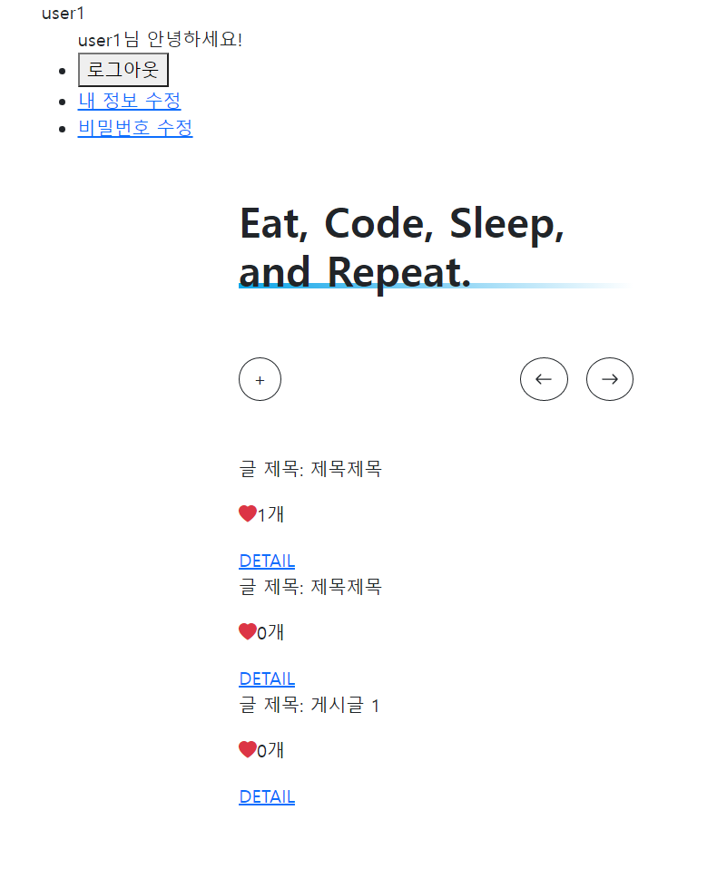
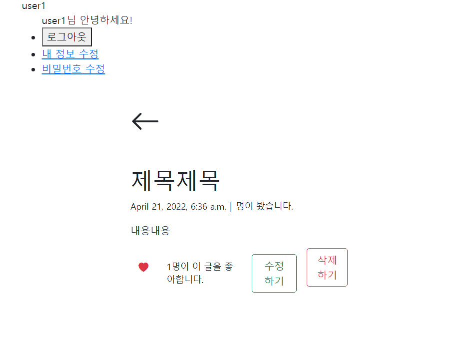

# 0418_workshop


## Model

```python
from django.db import models
from django.conf import settings

# Create your models here.
class Article(models.Model):
    user = models.ForeignKey(settings.AUTH_USER_MODEL, on_delete=models.CASCADE)
    like_users = models.ManyToManyField(settings.AUTH_USER_MODEL, related_name='like_articles')
    title = models.CharField(max_length=20)
    content = models.TextField()
    created_at = models.DateTimeField(auto_now_add=True)
    updated_at = models.DateTimeField(auto_now=True)
```

`ManyToManyField`를 사용해서 게시글과 좋아요에 M:N 관계를 지정해준다.

## url

```python
from django.urls import path 
from . import views 

app_name = 'articles'

urlpatterns = [
    path('', views.index, name='index'),
    path('new/', views.new, name='new'),
    path('<int:pk>/edit/', views.edit, name='edit'),
    path('<int:pk>/delete/', views.delete, name='delete'),
    path('<int:pk>/like/', views.like, name='like'),
    # like 함수보다 아래에 있어야 좋아요가 반영된다
    path('<int:pk>/', views.detail, name='detail'),
]
```

## view

```python
from django.http import HttpResponse
from django.shortcuts import (render, redirect, get_object_or_404)
from django.contrib import messages
from django.contrib.auth.decorators import login_required
from django.views.decorators.http import require_http_methods, require_POST

from .models import Article
from .forms import ArticleForm

# Create your views here.
def index(request):
    articles = Article.objects.order_by('-created_at')
    context = {
        'articles': articles,
    }
    return render(request, 'articles/index.html', context)


@login_required 
@require_http_methods(['GET', 'POST'])
def new(request):
    """
    글쓰기 (ModelForm)
    - GET: 폼이 담긴 템플릿 반환
    - POST: 사용자 요청 정보 유효성 검사 & 저장
    """
    if request.method == 'POST':
        form = ArticleForm(request.POST) # bound form
        if form.is_valid():                          # 유효성 검사
            article = form.save(commit=False)           # DB 저장
            article.user = request.user
            article.save()

            messages.add_message(request, messages.INFO, '글이 성공적으로 작성되었습니다.')
            return redirect('articles:index')
    else:
        form = ArticleForm() # unbound form
    
    context = {
        'form': form,
    }
    return render(request, 'articles/new.html', context)


def detail(request, pk):
    article = get_object_or_404(Article, pk=pk)
    context = {
        'article': article,
    }
    return render(request, 'articles/detail.html', context)


@login_required 
@require_http_methods(['GET', 'POST'])
def edit(request, pk):
    article = get_object_or_404(Article, pk=pk)
    
    if request.method == 'POST':
        form = ArticleForm(request.POST, instance=article) 
        if form.is_valid():               
            form.save()                              
            return redirect('articles:detail', article.pk, article.slug)
    else:
        form = ArticleForm(instance=article)
    
    context = {
        'form': form,
    }
    return render(request, 'articles/edit.html', context)


# @login_required # 로그인이 안되어있으면 => 로그인 페이지로 이동
@require_http_methods(['POST']) # POST 아니면 => 405 (Method Not Allowed) 에러 발생
def delete(request, pk):
    if not request.user.is_authenticated:
        # 401 == Unauthorized
        return HttpResponse('너 권한 없음...!', status=401) 
    
    article = get_object_or_404(Article, pk=pk)
    article.delete()
    messages.add_message(request, messages.ERROR, '글이 성공적으로 삭제되었습니다.')
    return redirect('articles:index')


def like(request, pk):
    # 좋아요 누른 게시글 정보와 유저 객체 가져오기
    article = get_object_or_404(Article, pk=pk)
    user = request.user

    # 이미 좋아요 누른 사람이라면
    if article.like_users.filter(pk=user.pk).exists():
        article.like_users.remove(user)

    # 좋아요를 처음 누른 사람이라면
    else:
        article.like_users.add(user)
    
    return redirect('articles:detail', article.pk)
```

## template

### index.html

```django
  
    <p>글 제목: {{ article.title }}</p>
    <p><i class="bi bi-heart-fill text-danger"></i>{{ article.like_users.all.count }}개</p>
    <a href="">DETAIL</a>
  
```

### detail.html

```django
  <form action="" method="POST">
    

    
      <button class="btn"><i class="bi bi-heart-fill text-danger"></i></button>
    
      <button class="btn"><i class="bi bi-heart text-danger"></i></button>
    
  </form>
  <small>{{ article.like_users.count }}명이 이 글을 좋아합니다.</small>
```

## 결과 화면



