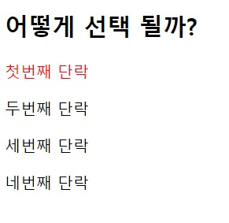
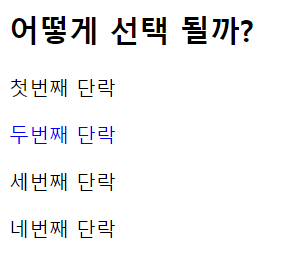

# 0203_workshop


## 1. img tag

```html

```

## 2. 파일 경로

```html
(a) 절대 경로
(b) 상대 경로 (내가 코드를 작성하고 있는 파일을 기준으로 한다)

```

부모, 즉 `user/` 폴더 레벨로 나가는 방법은 `../` 이다. 

## 3. Hyper Link

```html
<body>
  <a href="https://ssafy.com">
    
  </a>
</body>
```

## 4. 선택자

1) `#ssafy > p:nth-child(2)`

   

2) `#ssafy > p:nth-of-type(2)`

   

3) 차이점

   - `#ssafy > p:nth-child(2)`: `ssafy` id의 모든 자식들 중 `p` 태그면서 2번째인 것
   - `#ssafy > p:nth-of-type(2)`: `ssafy` id의 `p` 태그 자식들 중 2번째인 것